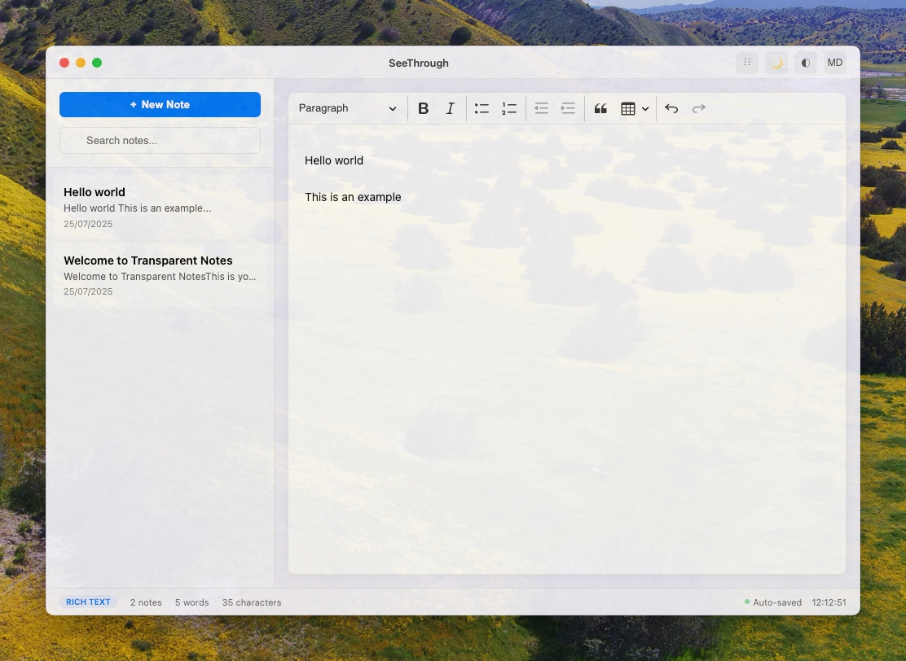

# SeeThrough User Guide

A transparent, always-on-top note-taking app for meetings.



Perfect for taking notes during video calls, presentations, and coding sessions while staying engaged with what's happening on your screen.

## 📦 Installation

### Homebrew (Recommended)

```bash
brew tap vinhnglx/homebrew-tap
brew install --cask seethrough
```

### Manual Download

1. Download the latest `.dmg` from [Releases](https://github.com/vinhnglx/seethrough-release/releases)
2. Open the DMG file
3. Drag SeeThrough to your Applications folder
4. Double-click to run

## 🎛️ How to Use SeeThrough

### Adjusting Transparency

**SeeThrough's main feature is its adjustable transparency:**

1. **Click the opacity button** (◐) in the top toolbar
2. **Drag the slider** to adjust transparency (30-95%)
3. **Click elsewhere** to close the opacity control

**Tips:**

- **Lower values** = more transparent (better for seeing through)
- **Higher values** = more solid (better for reading text)
- **Sweet spot**: 70-85% for most use cases

### Light/Dark Mode Toggle

**Switch between themes to match your environment:**

1. **Click the moon/sun button** (🌙/☀️) in the toolbar
2. **Or use keyboard shortcut**: `Cmd + D`

**The app remembers your preference and will restore it when you restart.**

### Managing Multiple Notes

**Organize your thoughts with the sidebar:**

1. **Toggle sidebar**: Click ⋮⋮ button or press `Cmd + B`
2. **Create new note**: Click "+ New Note" or press `Cmd + N`
3. **Search notes**: Use the search box or press `Cmd + F`
4. **Switch between notes**: Click any note in the sidebar
5. **Delete notes**: Hover over a note → click "Delete"
6. **Duplicate notes**: Hover over a note → click "Duplicate"

### Text Formatting & Rich Editing

**SeeThrough uses CKEditor for powerful text editing:**

#### Toolbar Options:

- **Headings**: Paragraph, Heading 1, 2, 3
- **Text Style**: Bold, Italic, Underline
- **Lists**: Bullet points, Numbered lists
- **Indentation**: Increase/decrease indent
- **Insert**: Block quotes, Tables
- **History**: Undo, Redo

#### Keyboard Shortcuts:

- `Cmd + B` - **Bold** text
- `Cmd + I` - _Italic_ text
- `Cmd + U` - <u>Underline</u> text
- `Cmd + Z` - Undo
- `Cmd + Shift + Z` - Redo

### Markdown Support

**SeeThrough has a Markdown toggle for different editing modes:**

1. **Enable Markdown mode**: Click "MD" button in toolbar
2. **The button turns blue** when Markdown mode is active
3. **Type in Markdown syntax** for quick formatting

**Note**: Currently the MD button toggles the mode indicator, but rich text editing is always available through the toolbar.

### Timestamps

**Add timestamps to track when notes were taken:**

1. **Press** `Cmd + T`
2. **Current date and time** will be inserted at cursor position
3. **Format**: `--- 2:30:15 PM ---`

### Auto-Save

**Your notes are automatically saved:**

- ✅ **Saves as you type** - no need to manually save
- ✅ **Persists between sessions** - notes are there when you restart
- ✅ **Local storage only** - everything stays on your Mac
- ✅ **Green dot indicator** shows when auto-save is active

## ⌨️ Complete Keyboard Shortcuts

### Note Management

| Shortcut  | Action           |
| --------- | ---------------- |
| `Cmd + N` | Create new note  |
| `Cmd + F` | Search notes     |
| `Cmd + B` | Toggle sidebar   |
| `Cmd + T` | Insert timestamp |

### App Controls

| Shortcut          | Action                 |
| ----------------- | ---------------------- |
| `Cmd + D`         | Toggle dark/light mode |
| `Cmd + Shift + N` | Show/hide app (global) |
| `Cmd  + Q`        | Quick note (global)    |

### Text Editing

| Shortcut          | Action     |
| ----------------- | ---------- |
| `Cmd + B`         | Bold       |
| `Cmd + I`         | Italic     |
| `Cmd + U`         | Underline  |
| `Cmd + Z`         | Undo       |
| `Cmd + Shift + Z` | Redo       |
| `Cmd + A`         | Select all |
| `Cmd + C`         | Copy       |
| `Cmd + V`         | Paste      |
| `Cmd + X`         | Cut        |

## 🔄 Updates

**Homebrew users:**

```bash
brew upgrade --cask seethrough
```

**Manual users:** Check [Releases](https://github.com/vinhnglx/seethrough-release/releases) for updates

## 🖥️ Requirements

- macOS 10.14 or later
- Works on Intel and Apple Silicon Macs

## 🔒 Security & Privacy

- Fully code-signed and notarized by Apple
- No security warnings on installation
- All data stays local on your Mac
- No internet connection required
- No telemetry or data collection

## 💬 Support

- 🐛 [Report Issues](https://github.com/vinhnglx/seethrough-release/issues)
- 💡 [Feature Requests](https://github.com/vinhnglx/seethrough-release/issues)
- 📧 Contact: vinh.nglx@gmail.com

---

Built by [Vincent Nguyen](https://github.com/vinhnglx)
